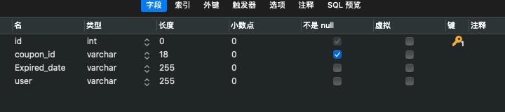

#消费券的创建和消费系统并将数据库存在mysql
* 表结构

* 用user字段为不为空来判断coupon_id是否是用过

|id | coupon_id  |Expired_date|user|
|  ----  | ----  |----|----|
| 自增id  | 主键varchar|varchar|varchaar|
* 创建一个以"coupon_id"为主键，"id"为自增id的数据库
>ALTER TABLE 'coupon' MODIFY COLUMN coupon_id VARCHAR(16)> UNIQUE
CREATE TABLE `coupon` (
`id` int NOT NULL AUTO_INCREMENT,   
`coupon_id` varchar(18) NOT NULL unique,
PRIMARY KEY (`id`)
) ENGINE=InnoDB AUTO_INCREMENT=1 DEFAULT CHARSET=utf8;

